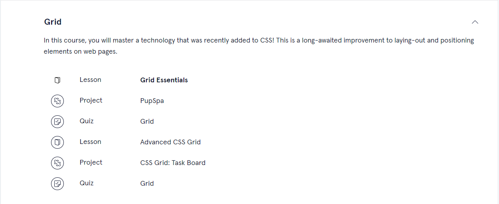
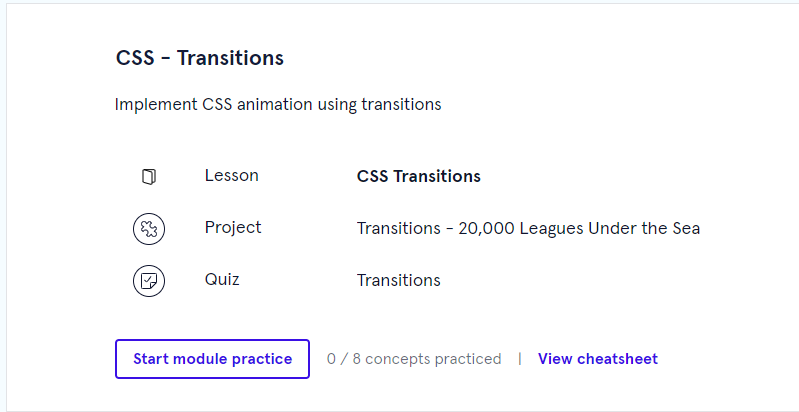
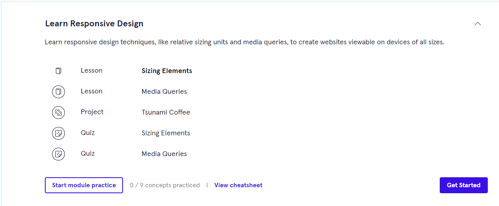

# Learn_Intermediate_CSS
> in dit pakket zitten meer dingen zie hier onder de link naar het lessen pakket.
[Learn Intermediate CSS Lessen Packet](https://www.codecademy.com/enrolled/courses/learn-intermediate-css)

> Hier onder heb je een afbelding van wat er in het totale Lessen Pakket Learn CSS zit.

## In de map [Layout with Flecbox] zit het volgende.
- De map met de naam [Les 1] is Flexbox
- De map met de naam [Project 1] is Flexbox To-Do App
- De map met de naam [Project 2] is Off-Platform Project: Tea Crozy

> in de afbeelding zie je de wat in [Layout with Flecbox] packet zit.

## In de map [Grid] zit het volgende.
- De map met de naam [Les 1] is Grid Essentials
- De map met de naam [Project 1] is PupSpa
- De map met de naam [Les 2] is Advanced CSS Grit
- De map met de naam [Project 2] is CSS Grid: Task Board

> in de afbeelding zie je de wat in [Grid] packet zit.

## In de map [Transitions] zit het volgende.
- De map met de naam [Les 1] is CSS Transitions
- De map met de naam [Project 1] is Transitions - 20,000 Leagues Under the Sea

> in de afbeelding zie je de wat in [Transitions] packet zit.

## In de map [Learn Responsive Design] zit het volgende.
- De map met de naam [Les 1] is Sizing Elements
- De map met de naam [Les 2] is Media Queries
- De map met de naam [Project 1] is Tsunami Coffee

> in de afbeelding zie je de wat in [Learn Responsive Design] packet zit.

